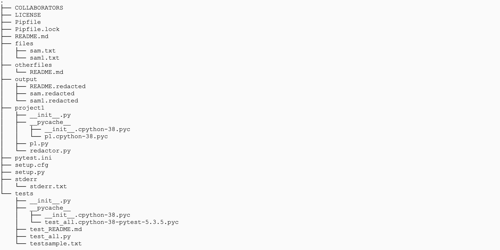

# cs5293p20-project1
In this project a text file(randomly selected from google and enriched with some information to meet my code specifications) is selected and senstive information like "names,dates,phone,genders etc" are redacted(masked so that its not visible in general). All this information is stored in output files with (.redacted) extention.
### Author :- Ram charan Reddy Kankanala
### Email :- Ramcharankankanala@gmail.com

### Structure

### Packages installed/used 
pip install pipenv \
pipenv install numpy &nbsp; \
pipenv install nltk &nbsp; \
import nltk \
import ssl \
import numpy \
import glob \
from nltk.corpus import wordnet \
from nltk.tokenize  import sent_tokenize,word_tokenize \
import re \
import os \
import argparse \
nltk.download('averaged_perceptron_tagger') \
nltk.download('maxent_ne_chunker') \
nltk.download('words') \
nltk.download('wordnet')

#### Python indentation is not followed in below code samples.

### project1--redactor.py
redactor file contains all function calls as arugument parsers.
> parser = argparse.ArgumentParser()
    parser.add_argument("--input", type=str, required=True, help="Source File location", nargs='*') makes sure that all files in that folder read into a list and passed to this function., action='append') \
      args = parser.parse_args() \
    a = p1.input(args.input) \
    
 nargs makes sure that all specified will be selected.\
 action = 'append' will appends every input read into list.
 
After cloning this repository. redacted.py is executed by following command in SSH 

> pipenv run python  project1/redactor.py --input "./files/*.txt" --input "./otherfiles/*.md" --names --dates --genders --phones --stats
 stderr  --concept "Extremely" --concept "marianne" --concept "Manners" --concept "imprudence"  --output "./output" 

By giving file paths that contains .txt and .md files here it will mask data and will store in output folder as "filename.redacted".

reference: - https://docs.python.org/3/library/argparse.html

### project1--p1.py
The p1.py file contains the methods to redact names,date,phonenumber,gender,given concept, all statistics of files reacted, saving files in output folder.

- **input(files)** \
This method takes one argument that is passed from argument parser that is files path of both (.txt and .md),as specified above all files with given input extention will be read into a list and passed to this method.Using glob and flattening lists each file data is stored in a single list.

> data = glob.glob(str(file)) \
            x.append(data) \
             y = nltk.flatten(x) \
              for i in y: \
        Read_data.append(open(i).read())

Finally in Read_data we will have a list of data of each file.

- **names(data)** \
This method takes one argument which is output of (input(files)) method.In this method all names from each document are found and replaced with (u"\u2588" - maskes data). \
**_Assumption made in this step: -_** some names may not be found and masked. It totally depends on nltk package.
-step: 1 \
First data is read from list. \
-setp: 2 \
using (wordtokenizer from nltk) words are seperated. \
-step: 3 \
using (pos_tag from nltk) parts of speech of each word is found. \
-step: 4\
using (ne_chunk from nltk) names of entites are found. \
-step: 5 \
using subtress,lables and leaves of named entites "PERSON" are found and masked. 

>  for entites in named_entites.subtrees():  \
            if entites.label() == "PERSON":  \
                for l in entites.leaves():  \
                    personames.append(l[0])
                    
 Finally masked names in each file is returned \
 reference: - https://www.programcreek.com/python/example/91258/nltk.ne_chunk , https://www.geeksforgeeks.org/nlp-extracting-named-entities/
 
 
 - **dates(data)** \
 This method takes one argument which is output of (input(files)) method.In this method all dates from each document are found and replaced with (u"\u2588" - maskes data). \
**_Assumption made in this step: -_** Only dates containing month,date and year are redacted.(Ex - 2020 jan format is not redacted) \
-step: 1 \
Data is read from list. \
-step: 2 \
using re.findall() with hard coded regular expression of all date formats, dates will be found and will be masked.

>d2 = (re.findall(     r'(?:January|February|March|April|May|June|July|August|September|October|November|December|Jan|Feb|Mar|Apr|May|Jun|Jul|Aug|Sep|Sept|Oct|Nov|Dec)[\s,]\d{1,2}[\s,]*\d{2,4}',i)) \
        for element in d2: \
            d1.append(element)

 Above date format is (Jan\01\01) and likewise all other date formats will be redacted(masked). \
 Finally file with redacted dates will be returned.\
 reference: - https://blog.softhints.com/python-regex-match-date/
 
- **phonenumber(data)** \
 This method takes one argument which is output of (input(files)) method.In this method all phonenumber from each document are found and replaced with (u"\u2588" - maskes data). \
**_Assumption made in this step: -_** Handles only certain phonenumber formats.\
Same as dates funtion re.findall() is used to find phonenumbers. \
> re.findall(r'\(?\+?[01]?[-\.\s]?\(?\d{3}\)?[-\.\s]?\(?\d{3}\)?[-\.\s]?\(?\d{4}\)?', i)

Finally file with redacted phonenumber will be returned.

- **concept(data, word)** \
 This method takes two argument which is output of (input(files)) method and specific word list.In this method all sentences with specified word list will be found and replaced with (u"\u2588" - maskes data). \
 
- step 1: - \
Data is read from list. \
- step 2: - \
Using wordnet,hyponyms every possible Synonym and hyponyms are found as below and stores in a list. \

> for w in word: \
        for syn in wordnet.synsets(w): \
            synonyms.append(syn.lemma_names()) \
            for l in syn.hyponyms(): \
                x=l.lemma_names() \
                synonyms_list.append(x)
 
- step 3: - \
Using word tokenizer and sentense tokenizer, data will be seperated. Tokenized words will be checked with above list and if found, word containing that sentense will be masked.

> for i in data: \
        sentences = sent_tokenize(i) \
        for sentence in sentences: \
            words=word_tokenize(sentence) \
            for item in All: \
                if item in words: \
                    i = i.replace(sentence, u"\u2588"*len(sentence))

Finally file with redacted concepts(provided as word) will be returned. \
references: - https://dzone.com/articles/nlp-tutorial-using-python-nltk-simple-examples

- **gender(data)** \
 This method takes one argument which is output of (input(files)) method.In this method all genders from each document are found and replaced with (u"\u2588" - maskes data). 
 
**_Assumption made in this step: -_** List of possible genders (commonly used) and will redact only genders in list.

 -step:- 1 \
 Data is read from list.
 
 
 -step:- 2 \
  A list of all possible genders is defined and using item.capitalize() all first characters of defined list will be converted into upper case and stored in another list. 
  
 >    for item in gender: \
        gender_C.append(item.capitalize())
        
-step:- 3\
Using word tokenizer and sentense tokenizer, data will be seperated. Tokenized words will be checked with above list, if found  u"\u2588" will be appended into new list , if not found normal word is appended. and all words in list will br joined with ' '. Same way sentences will be seperated , append  and will be joined with ' ' after masked item is joined. This whole process is because,(for ex. in "The" there will be "he" to not consider it as a gender above method is chosen.) 

>  for file in data: \
        m = [] \
        for s in sent_tokenize(file): \
            m_s = [] \
            words_sentence = word_tokenize(s) \
            for item in words_sentence: \
                if (item.lower() in gender or item in gender_C): \
                    m_s.append('\u2588') \
                else: \
                    m_s.append(item) \
            formedsentence = ' '.join([str(x) for x in m_s]) \
            m.append(formedsentence) \
        formedfile = ' '.join([str(x) for x in m]) \
        masked_genders.append(formedfile)

Finally only genders defined list will be masked and masked data will be returned. \
references: - http://nealcaren.github.io/text-as-data/html/times_gender.html

- **stats(data)** \
 This method takes one argument which is output of (input(files)) method.In this method number of masked items from each funciton is returned.In this method all above methods are called and count of u"\u2588" is checked in each method using word tokenizer and stored in a dictionary. This dictionary is passed into "extractstat" method to store this stats in already created "stderr.txt" file.
 **_Assumption made in this step: -_** File with name "stderr.txt" will be created in stderr folder beforehand and number of concepts masked are not returned(only names,phonenumbers,dates,genders are specified).
 
 > for item in x:\
            for i in item:\
                x = u'\u2588' * len(i)\
                if i == x:\
                    count += 1 \
            phonecount.append(count)

Finally this method returns number of masked items in each method. 

- **output(files, data, name)** \
This method takes 3 arguments actual files path, data and new folder path to be created. This method stores all masked files with ".redacted" extention. I am using function from "os" to get present directory, to join folder name, to get file name and attach it with ".redacted" extention. If "output" folder is not present, it will be created and all redacted files will be stored in that folder. If output folder is present it will directly store redacted files.

-step:- 1 \
newfolder path.
>newfilepath = os.path.join(os.getcwd(), name)

-step:- 2 \
getting file names and attaching ".redacted". 
>getpath = os.path.splitext(flattenf[j])[0]
        getpath = os.path.basename(getpath) + '.redacted'
        
-step: - 3 \
storing data in created .redacted files.

Finally all ".redacted" files will be stored in specified path.\
references: - https://www.geeksforgeeks.org/python-os-path-splitext-method/

### setup.py and setup.cfg
The setup.py file is required for finding the packages within the project during the execution. It finds the packages automatically.The setup.cfg file is required for running the pytest command to perform tests on the program.

### test_all.py
**_Assumption made in this test cases: -_** Files I selected for testing will contain (names,phonenumbers,dates,genders,concepts) in order to mask all. \
The test_a11.py file contains the test cases designed to test the functioning of the p1. The test_all.py file when executed runs every test case with the p1 and returns the output of failed and passed test cases.

- **test_names** \
This function test *names(data)* from p1.py .As two files named *testsample.txt and test_README.md* are created in local folder ,in this function it will be tested if in these folders names are masked or not(by checking the list length of masked names). 

>for i in masked_names: \
        wordlist = word_tokenize(i) \
        for j in wordlist: \
            x = u'\u2588' * len(j) \
            if j == x: \
                all.append(j) \
    assert all is not None
    
- **test_phone** \
This function test *phonenumber(data)* from p1.py .As two files named *testsample.txt and test_README.md* are created in local folder ,in this function it will be tested if in these folders phonenumbers are masked or not(by checking the list length of masked phonenumbers). 

- **test_date** \
This function test *dates(data)* from p1.py .As two files named *testsample.txt and test_README.md* are created in local folder ,in this function it will be tested if in these folders dates are masked or not(by checking the list length of masked dates). 

- **test_concept** \
**_Assumption made in this test cases: -_** only two words are given to mask sentences(['attention','uneasy']) \
This function test *concept(data,word)* from p1.py .As two files named *testsample.txt and test_README.md* are created in local folder ,in this function it will be tested if in these folders concepts(list of words) are masked or not(by checking the list length of masked concepts).

- **test_gender** \
This function test *gender(data)* from p1.py .As two files named *testsample.txt and test_README.md* are created in local folder ,in this function it will be tested if in these folders genders are masked or not(by checking the list length of masked genders).

- **test_stats** \
This function test *stats(data)* from p1.py .As two files named *testsample.txt and test_README.md* are created in local folder ,in this function it will be tested if returned dictonary from stats(data) is empty of not.

- **test_output** \
**_Assumption made in this test cases: -_** Expected to execute project first to create ".redacted" files. 
This function test *output(files,data,name)* from p1.py .This funtion tests if files with extention ".redacted" are present in output folder or not.

